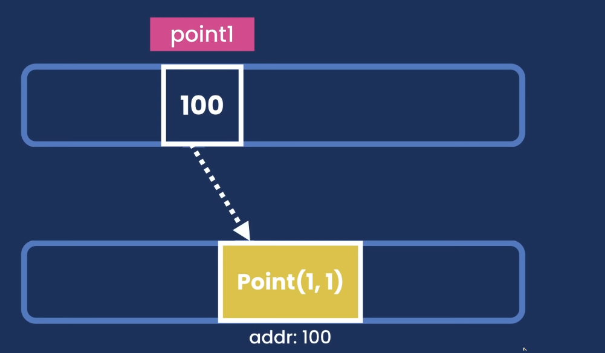

# java Types

Java types are divided in two main branches. These are **PRIMITIVE** and **REFERENCE** types. The difference between this two types are the memory management.

## Primitive
We use the **Primitive** types to store simple data such as integers numbers, float numbers, characters and boolean. These types are very low level so they don't have any kind of methods such us round in float numbers.

| Types   | Bytes | Range          |
| --------|:-----:| --------------:|
| byte    | 1     | [-128,127]     |
| short   | 2     | [-32k,32k      | 
| int     | 4     | `+- 2 ^ 31`    |
| long    | 8     | `+- 2 ^ 63`    |
| float   | 4     | `Decimal`      |
| double  | 8     | `Decimal`      |
| char    | 2     | `A B C D E`    |
| boolean | 1     | `true` `false` |

#### Example
Long numbers need to end with an L if they are NOT the result of an operation so we manually define they value as in the example, we need to do the same with the float numbers with an F instead of a L.

```java
// ______ Integers Numbers _______ //

byte currentUsers = 30; // [-128,127]
short errorCount = 17260; // [-32k,32k]
int worldPopulation = 12341234; // 2 ^ 31 = 2147483648
long atoms = 21232131234332L; // 8 bytes = 9.22337203685e+18

//_____ Floating Numbers _____ //
float price = 45.43F;
double atomWidthCm = 0.00000000000001F;

// _______ Others _____ //
char letter = 'A';
boolean ableToDrive = true; // false
```

## Reference
This types are used to store complex objects like dates or mail messages or an instance of class. They are able to have methods and properties...
#### Example
```java
package basics.types;
import java.util.Date;
public class ReferenceTypes {
    public static void main(String[] args) {
        int age = 30;
        // without using the import
        java.util.Date now = new java.util.Date(); 
        // Using the import
        Date future = new Date();
    }
}
```

## Primitive VS Reference
The difference between how memory works with primitive types and with reference types is that references are called that way because they do not store the value of the object itself, but instead store the number of a location in memory where the object in question is stored.

For this reason, if we create a new variable and assign the value of our previous variable, it will be assigned the value of the memory location where the object is stored, and that is why when we modify one object, the other will also be modified, because both They point to the same memory address. With the following example it is easy to understand.

## Example

#### Primitive
```java
byte x = 1;
byte y = x;
```
This image represents the above code where we have two variables `x` and `y` where y value is x.

```java
byte x = 1;
byte y = x;
x = 2;
```
If we change `x` value to 2, `y` value still beeing 1 as you can se. So when we assign a primitive variable to another we are **COPYING** the value of one to another.


#### Reference 

In this example we are using **Point** type wich is not a primitive type so it's a reference one. It doesn't matter what a **Point** is, we just neet to keep in mind that a **Point** object has two properties `x` and `y` that we are able to change.

```java
Point point1 = new Point(1,1);
```

First of all we are defining a new point wich is point1. The above code is reserving some memory space for an object and storing the value of the memory position in the point1 value. So the point1 value is a memory position value.



Now let's imagine that we are creating a second point object that is assigned the value of `point1` that is called `point2` as we can see in the following code.

```java
Point point1 = new Point(1,1);
Point point2 = point1;
```

As we said before the value of point1 is not the value of the object, is the value of the memory addr point2 now has the same momory addr as point1 and this mean that they are pointing the same object and if we modify one of them the other one is going to be modified to because they are pointing to the same memory addr. 
We can say that we are **COPYING** the memory addr.


If we have the following code the value of point 2 when it's printed in the terminal is
`java.awt.Point[x=2,y=1]` and as you can se we are printing point2 and not point1.
```java
Point point1 = new Point(1,1);
Point point2 = point1;
point1.x = 2;
System.out.println(point2);
```

We need to keep in mind that this only work with properties of the object as can be `x` or `y` in the Point type. But now let's imagin we have the following code.

```java
Point point1 = new Point(1,1);
Point point2 = point1;
point1 = new Point(2,2);
System.out.println(point2);
```

In this case the output is going to be
`java.awt.Point[x=1,y=1]`
because `point1` is not pointing to the same memory addr anymore because we are creating a new object in memory that is going to have `x=2` and `y=2`. And this **new** object is pointing to another memory addr.